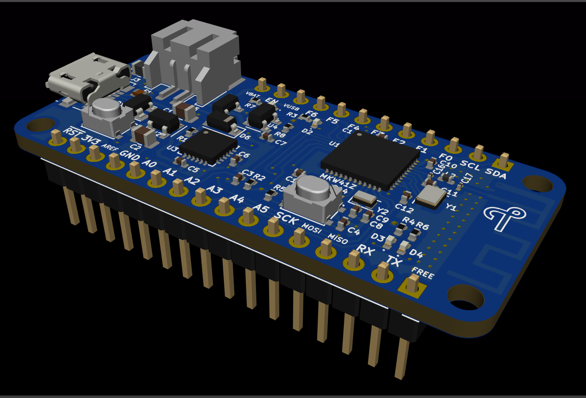

# KW41Z_feather 
 
A feather form factor for BLE, ZigBee or Thread node based on the NXP MKW41Z wireless microcontroller. This is work in progress and a completely untested design as at this point. 

## Preview

## Features 

* Feather header pins (custom mapping due to limited MCU pins)
* NXP MKW41Z Wireless MCU With a PCB antennae
* SWD Debug (using some of the feather header pins)
* USB to UART (CP2104) connected to the MCU UART terminal
* LiPo battery charger (SL4054ST25P) with a standard battery connector
* On board 5V to 3.3V regulator
* RTC oscillator
* Reset and user buttons
* Indicator LEDs (One user LED, two BLE activity LEDs) 

## Planned 

* Add U.FL connector for external antennae with a series selection resistor
* Add on-board SD card connector (back side) 
